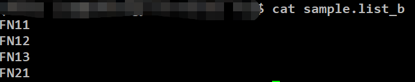
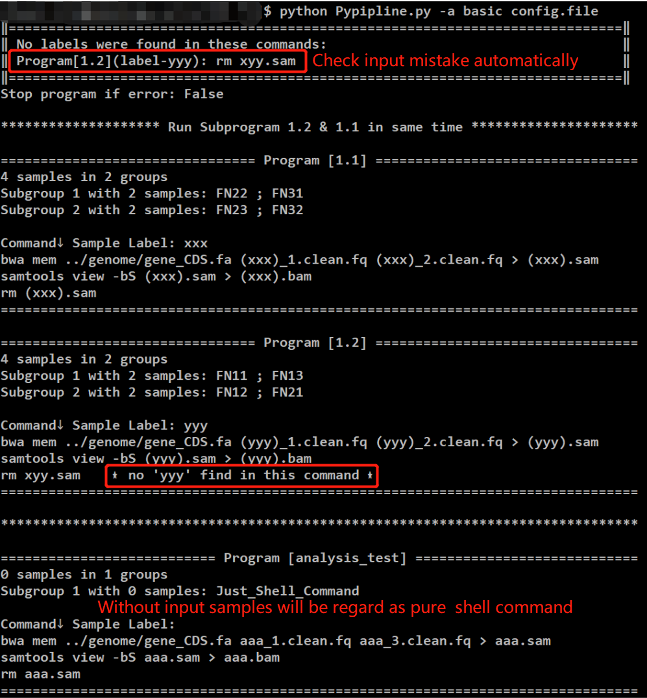
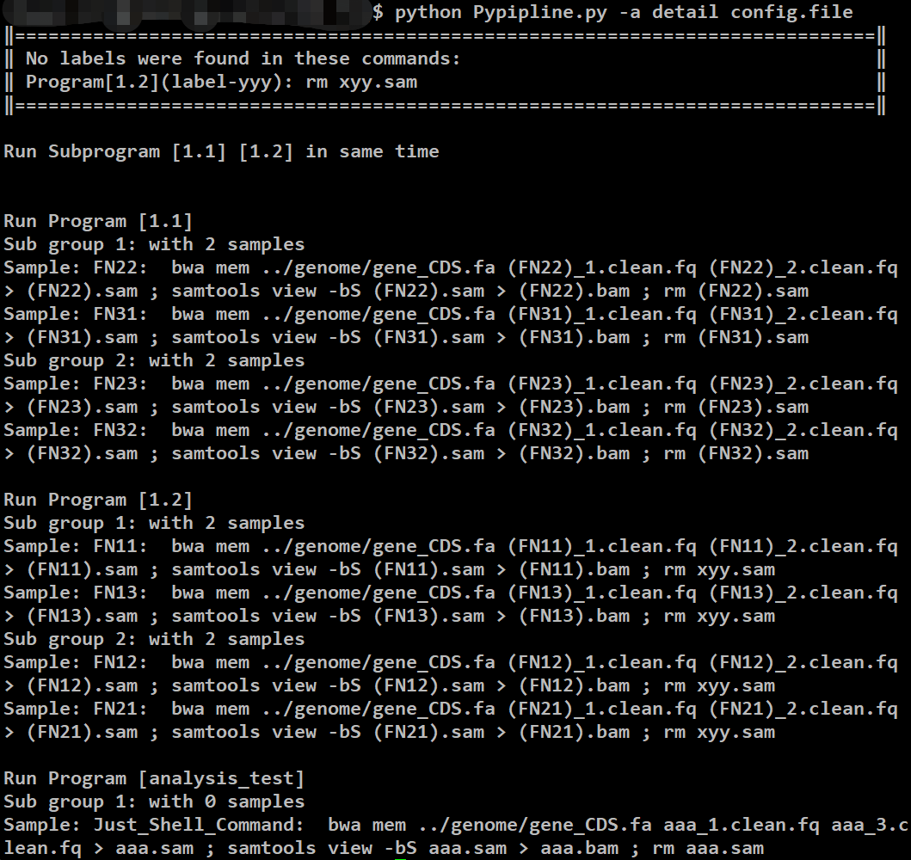
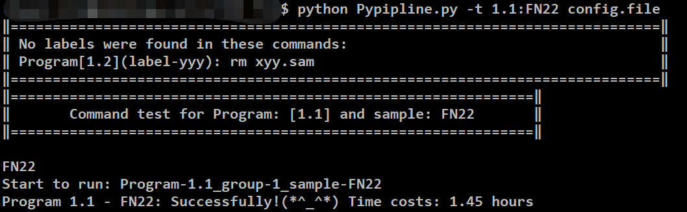

# <u>Python script to build easy bioinfomatic analysis pipline</u>  
  

## Examples and usages

### Configure file: easy to construct the pipline  
***Example of config.file***  
```
# stop_if_error True

1.1,i -> FN22 ; FN23 ; FN31 ; FN32
1.1,t -> 2
1.1,p -> bwa mem ../genome/gene_CDS.fa xxx_1.clean.fq xxx_2.clean.fq > xxx.sam
1.1,p -> samtools view -bS xxx.sam > xxx.bam
1.1,p -> rm xxx.sam

1.2,i(yyy) -> from-file=sample.list_b
1.2,t -> 2
1.2,p -> bwa mem ../genome/gene_CDS.fa yyy_1.clean.fq yyy_2.clean.fq > yyy.sam
1.2,p -> samtools view -bS yyy.sam > yyy.bam
1.2,p -> rm xyy.sam

analysis_test,p -> bwa mem ../genome/gene_CDS.fa aaa_1.clean.fq aaa_3.clean.fq > aaa.sam
analysis_test,p -> samtools view -bS aaa.sam > aaa.bam
analysis_test,p -> rm aaa.sam
```  
*sample.list_b*  

So, the format for each line is: 
```
Program name , Parameter type -> Content(';' for separate content)
# Only ',' '->' and ';' will be used to sparate field, so white space near these markers will be omitted. you can input like:
1,i->aaa;bbb;ccc
or with white space, like
1   , p    -> aaa    ；   bbb
```
___
<u>**Global parameters</u>**  
`# stop_if_error True/False`  

*Stop or not if errors(default False), which can be omitted*  
___
<u>**Program name** </u> :  
**1. Single program:**&emsp;*character or integer，such as: '1', '88', 
'mapping', 'remove_adapter'.*  
  
**2. Parallel program:**&emsp;*main_name.child_name，such as: '3.1', '3.2', '3.3' or "mapping.filter", "mapping.run", "mapping.stats"* ,program with same main name will run parallelly.

***
<u>**Parameter type :**</u>  
**1. i:**&emsp;*->(content)input samples, which is sparated by ';', samples sparated by ' ' will be regard as one input sample, this Parameter line can be used for multiple lines to add samples,such as:*
```
1,i -> aaa ; bbb
1,i -> ccc ; ddd
1,p -> sleep 10

```   
*use from-file=aaa.txt can read and use the items in aaa.txt, similarly, separaters are ';' and '\n' *  
  
**2. t:**&emsp;*->(content)number of parallel runing jobs or programs, default:1. '!' means run all input samples in the same time*  
  
**3. p:**&emsp;*->(content)processing command(shell command), sample name should be repalced by xxx(default sample label) in this part. You can alse change sample label to other values (yyy, zzz, abc) as you need just in this program, in i lines with i(yyy),the spaces on both sides of the words in parentheses will be automatically ignored.*  
***
### Usage 1:  get summary information or run pipline

```Shell
Python3 Pypipline.py -a/--action action config_file
```
#### Optional values for action:
1.  ***action = basic*** (default)   
print basic pipline information extracted from config_file 

2.  ***action = detail***    
print detail commands which will run in this pipline by sequence   

3.  ***action = run***    
after check the basic information above, use this parameter to run pipline     
___  
### Usage 2: program test (for shell command)

```Shell
Python3 Pypipline.py -t/--test Program_name:Sample_name config_file
```

#### Descriptions:
***Program_name:Sample_name***   
If sample name was not given, the first sample in this program will be used.  

___

